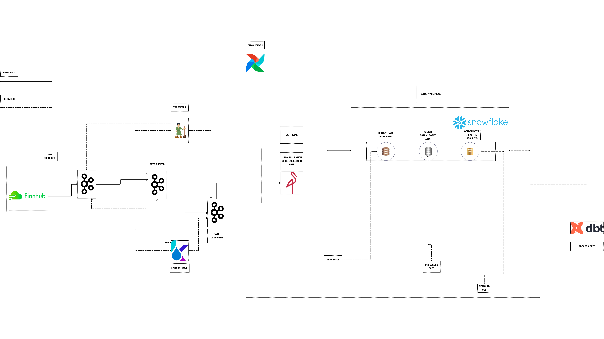

# 📈 Real-Time Financial Market Data Pipeline (Snowflake, Kafka, Airflow)

## 🌟 Project Overview


This project details the design and deployment of a **highly scalable, fault-tolerant data pipeline** engineered to ingest, process, and analyze real-time market data from **Finnhub**. The architecture leverages cloud-native principles, utilizing a decoupled streaming layer to ensure low-latency data availability for downstream analytics.

**Key achievements include:**

* Implementing a **Medallion Architecture (Bronze, Silver, Gold)** within **Snowflake** for strict data governance and quality assurance.
* Establishing reliable, scheduled data transformations using **dbt** and **Airflow**.
* Utilizing **Apache Kafka** to decouple the data ingestion from the processing logic, enabling massive horizontal scaling.

---

## 🏛️ System Architecture

The following diagram illustrates the component integration and the progression of data through the various layers of the pipeline, from external ingestion to final analytic storage.



---

## 🛠️ Technology Stack

This pipeline was built using a best-in-class modern data stack, emphasizing performance, scalability, and ease of maintenance.

| Category                    | Tool / Service                                                                                                                                                                                                             | Technical Functionality and Rationale                                                                                                                                |
| :-------------------------- | :------------------------------------------------------------------------------------------------------------------------------------------------------------------------------------------------------------------------- | :------------------------------------------------------------------------------------------------------------------------------------------------------------------- |
| **Data Ingestion**    |                                                                                                                           | Primary source for streaming real-time stock market data.                                                                                                            |
| **Streaming Layer**   | &nbsp;&nbsp; | Provides a distributed commit log for high-throughput, fault-tolerant message delivery, decoupling producers from consumers. Zookeeper handles cluster coordination. |
| **Data Lake Staging** |                                                                                                                               | Serves as the immutable Bronze Layer (RAW DATA) for historical storage, ensuring data is never lost.                                                                 |
| **Orchestration**     |                                                                                                                     | Manages complex DAGs (Directed Acyclic Graphs) for scheduling, monitoring, and idempotently retrying ELT jobs.                                                       |
| **Transformation**    |                                                                                                                                   | Defines data models using modular, reusable SQL transformations to build the Silver and Gold layers, providing robust testing and documentation.                     |
| **Data Warehouse**    |                                                                                                                       | Cloud-native, scalable Data Warehouse used for final storage, complex querying, and providing the compute layer for dbt transformations.                             |
| **Monitoring**        |                                                                                                                                        | Web UI for real-time inspection of Kafka topic partitions and message consumption offsets.                                                                           |

---

## ⚙️ Robustness and Scalability

This pipeline was specifically designed to handle high-volume streaming data with resilience:

* **Decoupling:** **Kafka** acts as a reliable buffer, allowing consumers to process data at their own pace and ensuring the system remains operational even during downstream outages.
* **Idempotency:** All **Airflow** tasks and **dbt** models are designed to be idempotent, allowing tasks to be safely re-run without creating duplicate or incorrect records, which is crucial for reliable failure recovery.
* **Layered Architecture:** The three-tier (Bronze, Silver, Gold) structure isolates raw, clean, and modeled data. This means any errors in the Gold layer can be traced back and accurately rebuilt from the immutable Bronze layer.
* **Cloud-Native Scale:** **Snowflake** provides instant, elastic compute resources, ensuring performance scales dynamically with data volume and query complexity.

---

## 🚀 Setup and Deployment

### Prerequisites

To run this project locally, you will need:

* **Docker** and **Docker Compose**
* Access and credentials for a **Snowflake** environment.
* Necessary **API keys** (e.g., Finnhub, stored securely in Airflow connections).

### Execution Steps

1. **Clone the Repository:**
   ```bash
   # Clone the project repository
   git clone https://github.com/amineelgardoum-rgb/Stocks_streaming_etl_pipline.git
   cd stock-data-pipeline
   ```
2. **Service Initialization:**
   * Start all containerized services (**Kafka, Zookeeper, MinIO, Airflow**, etc.) using Docker Compose:
     ```bash
     # Start all services in detached mode
     docker-compose up -d
     ```
3. **Configure Airflow:**
   * Access the **Airflow UI** (`http://localhost:8080`),you can login use admin in username and also admin in the password and configure connections for **Snowflake**, **MinIO**, and the **Finnhub** API key.
4. **Data Modeling:**
   * Verify **dbt** profiles are correctly configured to connect to **Snowflake**.
   * Run initial dbt seed files and tests.
5. **Run Pipeline:**
   * Unpause the main **Airflow DAG**  minio_to_snowflake to begin data flow from the minio (data lake) to snowflake(data warehouse).
   * Monitor stream health via **Kafdrop** (`http://localhost:9000` - *Assuming port 9000 for Kafdrop*) and task status via the Airflow UI.

---

## 🔭 Future Enhancements

* Integrating a visualization layer (e.g., Streamlit or Plotly Dash) for real-time dashboarding directly from the Gold layer.
* Implementing **Data Quality Checks (Great Expectations/dbt tests)** across all Silver and Gold models to enforce strict data integrity rules.
* Automating infrastructure provisioning using **Terraform** for full Infrastructure as Code (IaC) compliance.
